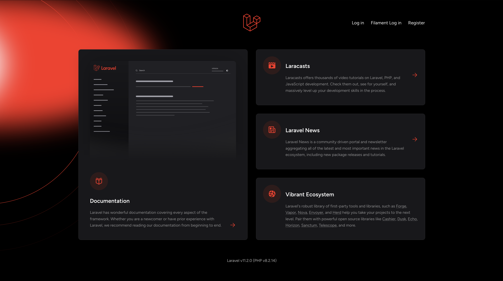

# Laravel Filament Starter Kit

### 1. Demo Pics

[//]: # (![Laravel Chat App](public/images/1.png))

|   |  |
|----------------------------------|---------------------------------|
|  |  |

|  |  |
|---------------------------------|---------------------------------|
|  |  |

|   |  |
|----------------------------------|----------------------------------|
|  |   |

| 

## Table of Contents
- [Introduction](#introduction)
- [Features](#features)
- [Installation](#installation)
- [Configuration](#configuration)
- [Usage](#usage)
- [Screenshots](#screenshots)
- [Technologies Used](#technologies-used)
- [License](#license)

## Introduction
The Laravel Filament StarterKit is a comprehensive solution crafted for developers building applications that require robust user management, patient tracking, and treatment oversight. Combining the simplicity of Laravel Breeze with the power of Filament, this StarterKit provides a clean and responsive backend interface, streamlined authentication, and essential user management tools.

Designed with scalability and ease of use in mind, this StarterKit simplifies the process of setting up an application with multiple user roles, customizable filters, and an informative dashboard that displays treatment statistics through intuitive charts. Whether you’re building a medical management system, a CRM, or any application that involves managing user or patient data, this StarterKit provides a versatile and efficient foundation to kickstart your project.
## Features
- Breeze
- Filament
- Authentication
- Users
- Owners
- Users Tab wise Filter
- Patients
- Treatments
- Dashboard with treatments chart

## Installation

### Prerequisites
- PHP 8.x
- Composer
- Node.js and npm
- MySQL or any other compatible database

### Steps

1. **Clone the repository**
   ```bash
   git clone https://github.com/AqibUllah/filament.git
   cd repository

2. **Install Dependencies**
    ```bash
    composer install

3. **Install Node Dependencies**
    ```bash
    npm install
    npm run build 
   ---OR--- 
   npm run dev for local
   
4. **Copy ENV File**
    ```bash
    cp .env.example .env --OR copy.env.example .env
   
5. **Setup ENV**
    ```bash
    php artisan key:generate
    php artisan config:cache
    php artisan config:clear
   
6. **Run Migrations**
    ```bash
    php artisan migrate --seed
